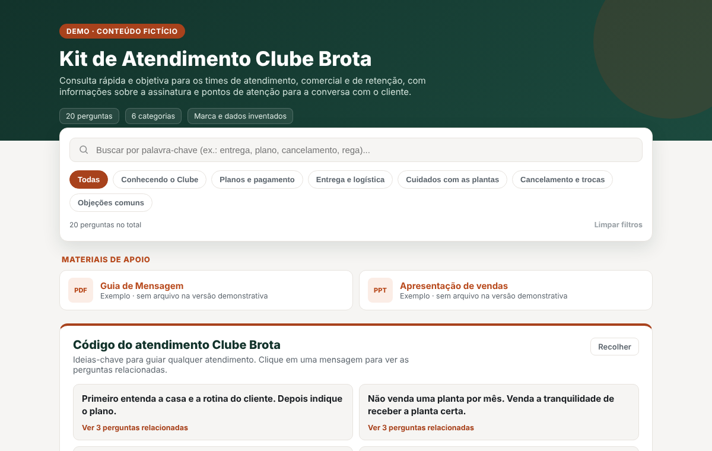

# FAQ de consulta rápida

Página de perguntas e respostas pensada para quem está no meio de um atendimento: a pessoa digita uma palavra e encontra na hora as perguntas relacionadas, organizadas por tema.



> **Sobre esta versão.** O projeto original foi desenvolvido em contexto profissional. Este repositório é uma versão demonstrativa: a estrutura e o código são os mesmos, mas a marca "Clube Brota" e todo o conteúdo são fictícios.

## Contexto

Os times de atendimento, comercial e retenção de uma instituição de ensino precisavam consultar informações sobre um produto durante o contato com o cliente. O pedido chegou como "criar uma FAQ", acompanhado de um material de referência.

## Meu papel

O texto das perguntas e respostas foi escrito por outra pessoa do time, a partir desse material. Eu fiquei responsável pela estrutura, pela experiência de uso e por todo o desenvolvimento front-end, do zero até a publicação.

## A decisão

Quem usa a FAQ está falando com um cliente e não tem tempo de rolar uma lista longa. Por isso a página foi estruturada como uma ferramenta de consulta, e não como um documento:

- **Busca em primeiro lugar.** A barra de busca fica no topo e filtra a cada tecla digitada.
- **Temas como atalho.** Os botões de categoria reduzem a lista a um assunto com um clique.
- **Orientação junto da resposta.** Cada pergunta pode trazer blocos coloridos com dica, frase sugerida, ponto de atenção, o que evitar e o que preferir.
- **Mensagens-chave ligadas às perguntas.** Um bloco no topo resume as ideias centrais do atendimento. Clicar em uma delas mostra só as perguntas relacionadas.

## Como funciona

- **Conteúdo separado da lógica.** Todas as perguntas ficam em `faq-data.js`. Quem atualiza o conteúdo não precisa mexer no restante do código.
- **Busca.** Procura o termo na pergunta, na resposta e nas orientações, ignorando as tags HTML do conteúdo.
- **Filtros gerados a partir dos dados.** Criar uma categoria nova em `faq-data.js` já cria o botão de filtro e atualiza os contadores do cabeçalho.
- **Numeração fixa.** Cada pergunta mantém o mesmo número com ou sem filtro, o que facilita a referência entre colegas ("veja a 12").
- **Contador e limpar filtros.** A página mostra quantas perguntas estão visíveis e permite voltar ao estado inicial com um clique.
- **Acordeão.** As respostas abrem e fecham com transição suave, calculada pela altura real do conteúdo.
- **Preferência salva.** O bloco de mensagens-chave pode ser recolhido, e a escolha fica guardada no navegador.
- **Responsiva e pronta para impressão.** O layout se adapta a telas pequenas, e a versão impressa mostra todas as respostas abertas.

## Tecnologias

HTML, CSS e JavaScript puro, sem bibliotecas nem etapa de build. A versão original está hospedada na AWS (S3).

```
index.html     estrutura da página
styles.css     estilos, com as cores em variáveis no :root
script.js      renderização, busca, filtros e acordeão
faq-data.js    conteúdo (categorias, perguntas, orientações, mensagens-chave)
```

## Como rodar

Baixe a pasta e abra o `index.html` no navegador. Não é preciso instalar nada.

## Resultado

O time solicitante resumiu o retorno com uma comparação: pediram um talher e receberam a mesa posta.

A entrega foi além do escopo original: em vez de uma lista de perguntas, os times receberam uma ferramenta de consulta pronta para o dia a dia. O projeto recebeu elogios das áreas que passaram a usá-la e o reconhecimento de que resolvia uma necessidade que nem estava no escopo inicial.

## Próximos passos

- Busca que ignore acentos (encontrar "preço" ao digitar "preco").
- Destaque do termo buscado dentro das perguntas e respostas.
- Acordeão navegável por teclado, com `button` e `aria-expanded` em cada pergunta.

---

Desenvolvido por [Jéssica Maciel](https://www.linkedin.com/in/jessicamaciels/).
